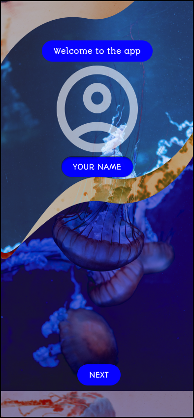
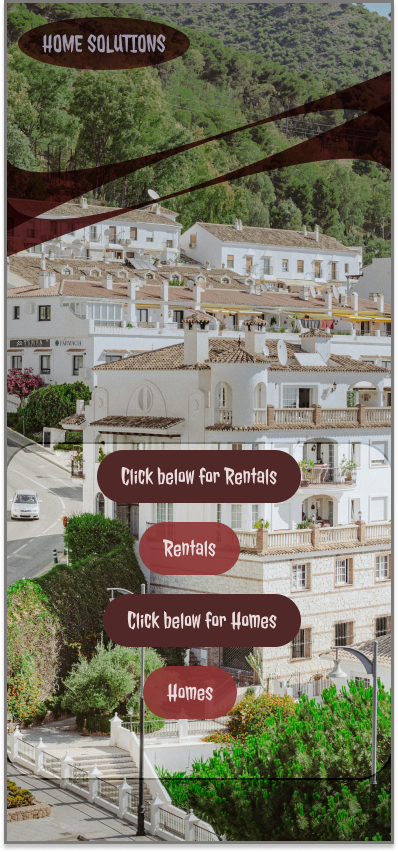

# Figma-Designs

  

I tried working on some interesting UI Designs on Figma this weekend. After going through a Udemy lesson and getting a few practice runsin, I managed to create an interesting design for my next two projects.

To be able to see the transitions, the projects are; [project 1](https://www.figma.com/file/ytxN3JoZbHh5kPE3DNErOu/Untitled?t=D9WRcb9nz52t9e2v-1 " at figma") and [project 2](https://www.figma.com/file/FhLbVA0zg1SqnfVrvbFT5r/Untitled?node-id=0%3A1&t=D9WRcb9nz52t9e2v-1) on the Figma app.
